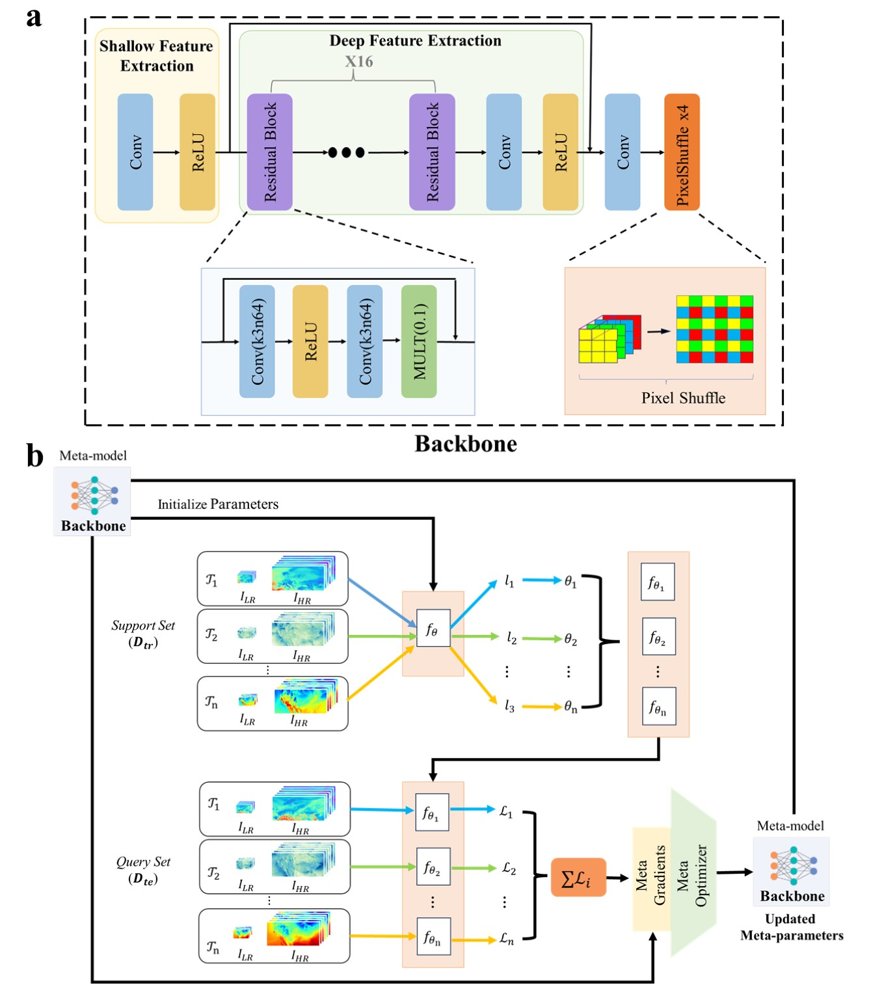

# MetaSD: A Unified Framework for Scalable Downscaling of Meteorological Variables in Diverse Situations
## Accepted by 
**The official repository with Pytorch**

Our paper can be downloaded from [paper](https://arxiv.org/abs/2404.17611).

## Introduction

MetaSD is a novel approach proposed in this paper that addresses the challenges of downscaling meteorological variables by leveraging meta-learning. Unlike existing downscaling methods that focus on individual variables in isolation, MetaSD aims to provide a unified framework capable of downscaling diverse meteorological variables derived from different numerical models and spatiotemporal scales. By training on variables such as temperature, wind, surface pressure, and total precipitation from ERA5 and GFS, MetaSD demonstrates its ability to capture the interconnectedness among various variables. This generalized downscaling model outperforms existing top downscaling methods, as evidenced by both quantitative and qualitative assessments.



## Installation
**Clone this repo:**

```bash
git clone https://github.com/neuralchen/MetaSD.git
cd MetaSD
```
**Dependencies:**

- python3.6+
- pytorch
- scikit-image, scipy, tqdm, imageio, numpy, opencv-python

## Training

To train the model use the following command:

```
python train.py
```


## Datasets

Our data can be downloaded from [data](https://drive.google.com/drive/folders/1Mf2QBt-hAFUzdzkpEFVcEHX74Qv89t5v).


## Inference with a pretrained MetaSD model
### Pretrained Models
- Baidu Netdisk (百度网盘)：https://pan.baidu.com/s/1ui-GSbAQLuTyOmxBlAQZVg 
- Extraction Code (提取码)：lspg

## Ackownledgements
This code is built based on [MAML](https://github.com/cbfinn/maml) and [EDSR](https://github.com/sanghyun-son/EDSR-PyTorch). We thank the authors for sharing the codes.

## Citation
If you use this paper work in your research or work, please cite our paper:
```
@ARTICLE{2024arXiv240417611H,
       author = {{Hu}, Jing and {Zhang}, Honghu and {Zheng}, Peng and {Mu}, Jialin and {Huang}, Xiaomeng and {Wu}, Xi},
        title = "{MetaSD: A Unified Framework for Scalable Downscaling of Meteorological Variables in Diverse Situations}",
         year = 2024,
          eid = {arXiv:2404.17611},
       eprint = {2404.17611},
}
```
